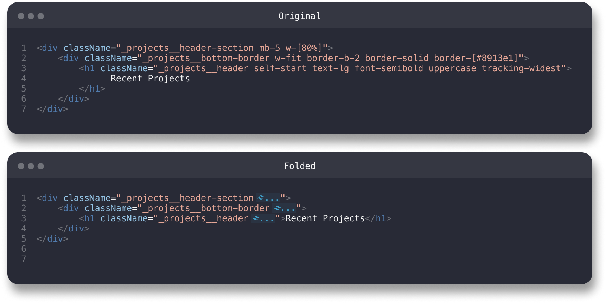

# Tailwind Fold With Class Names

Tailwind CSS offers a fantastic way to style your projects. It's easy to replicate across different projects, minimizes overall code, and eliminates those cumbersome CSS files. However, I've always encountered two main challenges with it:

1. It can look cluttered and hard to read.
2. It's difficult to quickly identify the component you're working with.

To address these issues, some developers devised the Inline Fold solution, which hides the CSS classes when you're not using them. I've taken it a step further by modifying it to always display the first class in your class or className attribute. This tweak allows you to create recognizable names for your HTML elements, so you can still apply BEM or any other naming conventions.

Read on to learn more about this improved solution!

## Features

By default, automatic folding is enabled, but you can customize this behavior in the settings.
**PRO TIP** - Quickly toggle folding using the keyboard shortcut `Ctrl+Alt+A`

## Extension Settings

This extension allows for the following settings:

-   `tailwind-fold.autoFold`: Enable/disable automatic class attribute folding
-   `tailwind-fold.unfoldIfLineSelected`: Unfolds class attributes if line is selected
-   `tailwind-fold.showTailwindImage`: Show/hide the tailwind logo infront of folded content
-   `tailwind-fold.foldedText`: Text to show when class attributes are folded
-   `tailwind-fold.foldedTextColor`: Color of the text when folded
-   `tailwind-fold.foldedTextBackgroundColor`: Background color of the text when folded
-   `tailwind-fold.unfoldedTextOpacity`: Opacity of unfolded class attributes
-   `tailwind-fold.supportedLanguages`: Array of languages the extension is enabled for
-   `tailwind-fold.foldLengthThreshold`: Specifies the minimum number of characters required for a section to fold

## Notes

_This extension folds all class attributes, even if there are no tailwind specific attributes._
_Credit due to stivoat! This is a modified fork of "Tailwind Fold" (See https://github.com/stivoat/tailwind-fold for original)._
